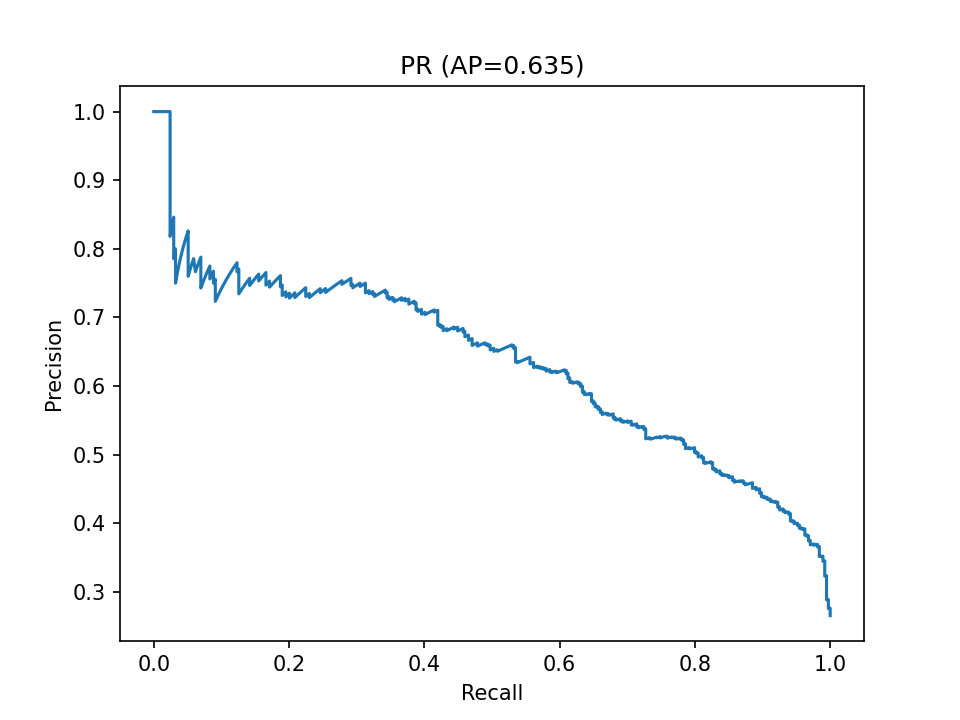

# Customer Retention Prediction Service

Сервис прогноза риска оттока клиентов для подписочного онлайн-сервиса.  
Предоставляет API (FastAPI) и CLI для скоринга, поддерживает валидацию входа по JSON-схеме, пороговую калибровку и выгрузку Top-K.




---

## Цель проекта
Клиент (онлайн-сервис с подпиской) хотел снизить отток пользователей.  
Задача — построить модель, которая предсказывает вероятность ухода (churn) для каждого клиента.  
Это позволяет вовремя запускать удерживающие кампании: скидки, промокоды, звонки от менеджеров.

---

## Решение
- Подготовлен ML-пайплайн:
  - OneHotEncoder + StandardScaler
  - Logistic Regression (class_weight="balanced")
- Учтён сильный дисбаланс классов (≈25% churn vs 75% non-churn).
- Реализованы два интерфейса:
  - API (FastAPI) для интеграции в CRM.
  - CLI (predict.py) для пакетного прогноза CSV.
- Настройки (порог, top-k) вынесены в config.yaml.

---

## Метрики качества
| Метрика   | Значение |
|-----------|----------|
| ROC-AUC   | 0.840 |
| PR-AUC    | 0.635 |
| F1-score  | 0.621 |
| Recall    | 0.759 |
| Precision | 0.526 |
| Accuracy  | 0.754 |

Интерпретация: модель хорошо выявляет клиентов с риском ухода (высокий Recall), что важно для задач удержания.

---

## Использование

### Обучение модели
```
python src/train.py --input data/customers.csv --output model/model.pkl
```

### Предсказание (CLI)
```
python src/predict.py --input data/new_clients.csv --config config.yaml --output predictions.csv
```

### API
```
python -m uvicorn src.app:app --host 0.0.0.0 --port 8000
```

Пример запроса:
```
curl -X POST "http://127.0.0.1:8000/predict_one" -H "Content-Type: application/json" -d "{\"features\":{\"tenure\":12,\"MonthlyCharges\":70.5,\"Contract\":\"Month-to-month\"}}"
```

Ответ:
```
{"proba": 0.82, "label": 1}
```

---

## Валидация входных данных
Контракт входа описан в schemas/input_schema.json (JSON-Schema).  
API валидирует как JSON-объекты, так и записи из CSV.

---

## Отчёт и графики
Скрипты в report/ автоматически генерируют метрики и графики:
```
python report/plots.py
python report/thresholds.py
```

Файлы:
- report/metrics.md
- report/roc_curve.png, report/pr_curve.png, report/prob_hist.png
- report/thresholds.csv, report/precision_at_k.txt

---

## Структура проекта
```
customer_retention/
 ├── src/
 │   ├── train.py
 │   ├── predict.py
 │   └── app.py
 ├── report/
 ├── schemas/
 ├── config.yaml
 ├── DATA_PRIVACY.md
 ├── MODEL_CARD.md
 ├── requirements.txt
 └── README.md
```

---

## Приватность данных
Данные клиента не публикуются (NDA). Репозиторий содержит код, конфиги и артефакты качества.  
Для интеграции используйте свои данные, соблюдая config.yaml и schemas/input_schema.json.